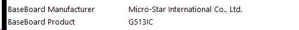
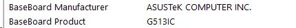
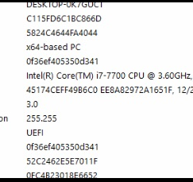
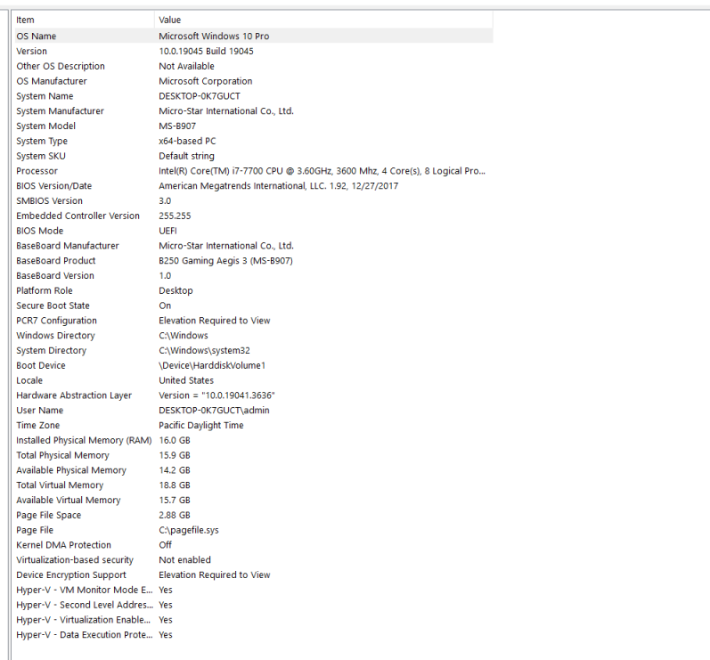
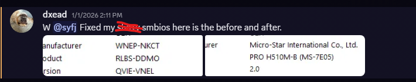

# SMBIOS Autodump

A local tool for extracting SMBIOS information from supported motherboard BIOS
firmware. It fetches a board's BIOS package, finds the firmware image, runs
`extractor.exe`, and prints the resulting JSON in the terminal.

## Purpose

This project was created to help diagnose and repair corrupted or incorrect
SMBIOS tables on motherboards. These problems can happen after misuse of AMI
tools or when a prebuilt-system supplier has written system information that
does not match the actual motherboard. Incorrect system information can cause
hardware features such as fan control to stop working as expected.

### Examples

The screenshots below show incorrect SMBIOS board information and examples of
corrected values.

**ASUS board information before and after correction**

| Before                                                                         | After                                                                        |
| ------------------------------------------------------------------------------ | ---------------------------------------------------------------------------- |
|  |  |

**MSI extraction and system information examples**





**Example repair**



The tool extracts SMBIOS data to help with that repair process. It does not flash BIOS or change anything within the firmware of the motherboard, unless AMI tools such as AMIDEWINx64 are used to apply the values given in the output.

> **Important:** The firmware image must use **AMI Aptio V**. Other BIOS
> frameworks are not supported and will not work with `extractor.exe`.

## Requirements

- Node.js 20 or newer
- `extractor.exe` in the project root
- MSI, ASUS, or GIGABYTE for automatic BIOS lookup
- ASRock firmware can be processed with manual extraction
- Wine if running on Linux or macOS

## Setup

Install dependencies:

```sh
npm install
```

Start the local API:

```sh
npm start
```

The API listens on `http://127.0.0.1:4567` by default. Keep this terminal open
to see BIOS lookup, download, extraction, and extractor output.

To use a different port, set `AUTODUMP_PORT` in the environment or `.env` file.
On Linux or macOS, set `WINE_EXEC` or `WINEPREFIX` if you need to override the
default Wine settings.

### `.env` example

Create a `.env` file in the project root if you want to override defaults:

```dotenv
# local API port
AUTODUMP_PORT=4567

# only needed when running outside Windows
WINE_EXEC=wine
WINEPREFIX=.wine-joony
WINEARCH=win64
```

## Interactive demo

With the API running, open a second terminal in the project folder and run:

```sh
npm run demo
```

Enter the motherboard model and manufacturer when prompted. The demo sends a
request to the local API and prints the response. The API terminal displays
progress and the extracted JSON result.

BIOS lookup includes limited manufacturer-specific fallbacks for common model name omissions. For example, MSI lookup can have a missing `MAG` prefix when inputting the motherboard model or `WIFI` suffix, and Gigabyte lookup can omit explicit revisions such as `Rev. 1.0/1.1/1.2`. A fallback is used only when the manufacturer support page provides a valid BIOS download; this is not an AI-powered general fuzzy search. Check the model reported in the API terminal to confirm it matches your exact board before using/applying the extracted information.

## API

### `GET /health`

Checks whether the local API is running and reports queue status.

```sh
curl http://127.0.0.1:4567/health
```

### `POST /dump`

Queue a BIOS lookup and extraction. Provide the board model and manufacturer:

```json
{
  "board": "B450M MORTAR MAX",
  "manufacturer": "MSI"
}
```

Example request:

```sh
curl -X POST http://127.0.0.1:4567/dump \
  -H "Content-Type: application/json" \
  -d "{\"board\":\"B450M MORTAR MAX\",\"manufacturer\":\"MSI\"}"
```

Supported manufacturer values are `MSI`, `ASUS`, and `GIGABYTE` (case-insensitive).
ASRock is not available through automatic BIOS lookup due to bot protection by the website developers, understandably so. Accepted requests return
HTTP `202` and are processed one at a time. The response means the request was
queued; follow the API terminal for the final result.

## Manual extraction

To run `extractor.exe` on a firmware image already on disk:

```sh
node manual-dump.mjs <firmware-file> "[board-name]"
```

For example:

```sh
node manual-dump.mjs ./firmware.rom "MSI MAG B550M MORTAR"
```

The firmware image must also be AMI Aptio V for this workflow.
This manual workflow can be used with ASRock BIOS files when they meet that
requirement.

## Data handling

This version prints extraction results locally. It does not send SMBIOS data to a backend, database, Discord channel, or webhook. For practical use, it may be added to do so (e.g. added to an HTML website where the user can search up their specific motherboard model, then apply the values outputted by the tool. However, they must have the prerequisite AMI tool (AMIDEWIN OR AMIDEEFI) to apply the values)
